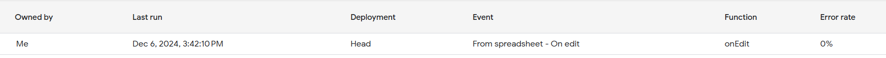
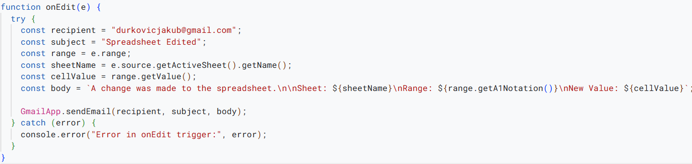

## Valeo Business Case

# Requirements

**Download as XLSX**  

This requirement was fulfilled with the `downloadAsXLSX()` in script.gs

**Email-Ready Report**  

This requirement was accomplished by `createDesignatedSpreadsheet()` in script.gs.

**Email-Ready reports V2**  

I've created a function `createDesignatedSpreadsheetAndExport()` which is successfully sending an email and also providing the recipient with the exported report into XLSX.

**Data Update**  

Since we are working with two different spreadsheets, I've added them both to the same folder along with my google app scripts. Data is being fetched in real-time from the designated spreadsheet.\
Link to the Drive folder: https://drive.google.com/drive/folders/1QYgnFcIXW-YLTbDuOqXWNc-xlrvJWDji?usp=drive_link

**Monitoring of changes**  

To monitor our source spreadsheets, I've used trigger that triggers on edit for both sheets.

# Visuals

To make it more visually appealing I've used regular CSS in order to make it more user friendly.

